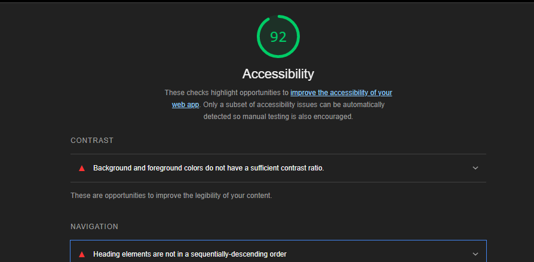

# Salmon Cookie Stand

Your friend Pat has come up with a business idea by combining his love for sweets and his passion for healthy ecosystems. Pat has developed a recipe for a coffee-time confection called Salmon Cookies. These cookies made into the shape of a salmon and are suitable for both humans and salmon to enjoy.

Pat needs some help with the branding of the business, as well as some help with internal data management for the company, and has enlisted your assistance because of your extensive and proven work in developing web applications.

Pat’s Salmon Cookies, soon with franchises internationally, needs a proof of concept application to calculate the number of cookies each location must make every day so that it can manage its supplies inventory and baking schedule. The number of cookies to make depends on the hours of operation (6:00 AM to 8:00 PM for all locations) and a few factors unique to each location:

- The minimum number of customers per hour.
- The maximum number of customers per hour.
- The average number of cookies purchased per customer.

Because we are early in the life of this business, we will need to build an application that is adaptable. Pat will need to be able to add and remove locations from the daily projections report, and Pat will also need to be able to easily modify the input numbers for each location based on day of the week, special events, and other factors. Pat would like to see these numbers with nice formatting in a web application.

